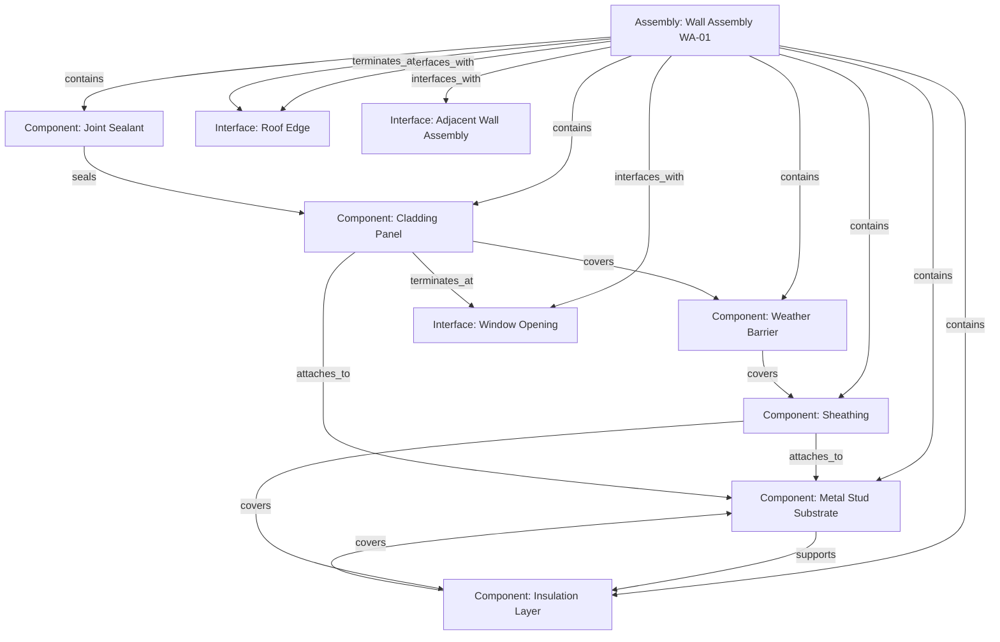

# Construction Assembly Graph

## Purpose

Define the canonical graph representation for construction assembly composition. The assembly graph is the machine-readable structure that encodes how assemblies, components, and relationships form bounded, typed, acyclic compositions.

---

## Graph Posture

The assembly graph is a **bounded, typed, directed acyclic graph (DAG)**. It is not an open ontology. It is not a knowledge graph. It is not a free-form relational database.

The graph exists to represent the physical compositional structure of construction assemblies in a form that supports deterministic validation, detail applicability, and drawing generation.

---

## Node Types

| Node Type | Description | Identity-Bearing |
|---|---|---|
| assembly | A governed construction assembly — the root compositional unit | Yes |
| component | A constituent part within an assembly | Only if independently identified |
| interface | A declared boundary where composition meets external conditions | No — declared, not independently identified |

Every node must have an explicit type. Untyped nodes are governance violations.

---

## Edge Types

Edges correspond to the relationship families defined in the Composition Model:

| Edge Type | Direction | Description |
|---|---|---|
| contains | parent → child | Assembly contains component |
| supports | supporter → supported | Structural support relationship |
| attaches_to | attached → target | Mechanical fastening |
| covers | covering → covered | Surface coverage |
| seals | sealant → sealed | Environmental separation |
| insulates | insulator → insulated | Thermal/acoustic separation |
| terminates_at | element → boundary | Edge or endpoint condition |
| transitions_to | source → target | Material/type transition |
| interfaces_with | assembly → external | Composition boundary declaration |

Every edge must carry an explicit type. Untyped edges are governance violations.

---

## Typed/Bounded Graph Rule

- The graph must be **typed**: every node and edge carries an explicit type from the allowed sets.
- The graph must be **bounded**: every composition graph has a single root assembly node and finite extent.
- The graph must be **acyclic**: no circular containment or support chains.
- The graph must be **connected**: no orphan nodes within a composition graph.

Violation of any of these properties must cause the composition to fail closed on completeness claims.

---

## Graph Use in Truth-Bearing Construction Objects

The assembly graph encodes composition for truth-bearing object types defined in the Identity System:

- **assembly** — root node of a composition graph
- **detail** — may reference specific graph nodes or edges where the detail applies
- **material application** — a component node with material-specific properties
- **condition** — may attach to graph nodes representing observed physical state
- **deviation** — may reference graph nodes or edges where deviation from approved composition is recorded

The graph does not replace these object types. It provides their internal compositional structure.

---

## Relationship to Identity and Truth Events

- **Identity governs the graph root.** The assembly node's identity is governed by the Construction Assembly Identity System. Components inherit compositional context from their parent assembly.
- **Composition changes produce truth events.** Adding, removing, retyping, or reordering components or relationships within a graph produces events in the Construction Truth Spine.
- **Graph structure is evidence-supported.** The composition represented in the graph must be traceable to source evidence (drawings, specifications, field observations).
- **Graph similarity is not identity.** Two assemblies with identical graph structure are not thereby the same object.

---

## Graph Change Posture

Graph changes are governed operations:

| Operation | Description |
|---|---|
| add_node | Add a component or interface to the graph |
| remove_node | Remove a component or interface from the graph |
| add_edge | Add a typed relationship between nodes |
| remove_edge | Remove a relationship between nodes |
| retype_node | Change the role of a component |
| retype_edge | Change the type of a relationship |
| reorder_layers | Change the layer sequence |

Every graph change must:
- Be recorded as a truth event
- Reference the assembly's governed identity
- Be traceable to source evidence
- Preserve graph validity (typed, bounded, acyclic, connected)

---

## Fail-Closed Rule

If a composition graph is incomplete, contains untyped nodes or edges, has cycles, has orphan nodes, or has unresolved interfaces, the system must fail closed on:

- Completeness claims for the assembly
- Buildability claims for the assembly
- Deterministic drawing generation from the assembly
- Detail applicability resolution for the assembly

The system must not silently patch, infer, or complete graph structure. Missing structure must be explicitly surfaced.

---

## Assembly Graph Diagram

This diagram shows a simplified wall assembly composition with:
- A root assembly node containing typed components
- Explicit support, coverage, attachment, and sealant relationships
- Declared interfaces at composition boundaries
- Termination conditions at building edges

---

## Safety Note

- This document defines architecture documentation only
- No runtime code, schemas, or implementations are modified
- No existing registry entries are changed
- Composition Model: `Construction_Kernel/docs/system/CONSTRUCTION_ASSEMBLY_COMPOSITION_MODEL.md`
- Governance doctrine: `Construction_Kernel/docs/governance/construction-assembly-composition-doctrine.md`
