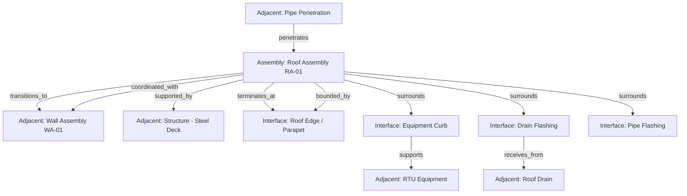

# Construction Interface and Adjacent Systems Model

## Purpose

Define the canonical model for how construction assemblies declare interface conditions with other assemblies, building edges, and adjacent systems. This model enables deterministic reasoning about assembly boundaries, terminations, transitions, penetrations, and coordination requirements.

---

## Position in Architecture

```
Universal_Truth_Kernel
  → Construction_Kernel
    → Assembly Identity System
    → Assembly Composition Model
    → Interface and Adjacent Systems Model  ← this document
    → Construction Truth Spine
    → Construction_Runtime
```

The Interface Model sits alongside the Composition Model. Composition defines internal structure. Interfaces define external context. Both attach to governed identities through the Truth Spine.

---

## Interface-Bearing Objects

The following construction objects commonly carry interface declarations:

| Object | Typical Interface Conditions |
|---|---|
| Roof assembly | Edge termination, parapet interface, drain penetration, equipment curb, skylight opening |
| Wall assembly | Base transition, head termination, window/door opening, penetration, adjacent wall |
| Parapet system | Cap termination, roof-to-wall transition, coping interface |
| Curb | Roof penetration, equipment base, flashing interface |
| Skylight | Roof opening, curb interface, glazing perimeter |
| Equipment base | Structural support, roof penetration, flashing perimeter |
| Drain body | Roof penetration, piping connection, flashing interface |
| Coping system | Parapet cap, wall termination, joint interface |
| Expansion joint | Assembly-to-assembly transition, movement accommodation |
| Facade tie-in | Wall-to-roof transition, structural attachment |
| Edge condition | Roof edge, wall base, soffit line, grade transition |
| Paver system | Roof surface interface, drain interface, edge restraint |
| Below-grade transition | Wall-to-foundation, waterproofing termination |

---

## Adjacent System Types

Adjacent systems are external systems that influence conditions at assembly boundaries:

| Adjacent System | Description |
|---|---|
| Wall | Exterior or interior wall system adjacent to the assembly |
| Structure | Structural frame, deck, beam, or column providing support |
| Equipment | Mechanical equipment mounted on or passing through the assembly |
| Mechanical penetration | Duct, pipe, or conduit passing through the assembly |
| Drain system | Roof drain, scupper, or overflow connected to the assembly |
| Facade system | Curtain wall, rainscreen, or cladding system at the boundary |
| Expansion system | Expansion joint or movement joint system at the boundary |
| Existing condition | Pre-existing construction condition at the interface |

Adjacent systems remain external. They influence interface conditions but do not become owned components of the assembly.

---

## Interface Relationship Families

| Relationship | Direction | Description |
|---|---|---|
| `interfaces_with` | Bidirectional | General typed interface between assembly and external condition |
| `terminates_at` | Directed | Assembly or component ends at a boundary condition |
| `transitions_to` | Directed | Assembly type changes to a different assembly type |
| `penetrates` | Directed | External element passes through the assembly |
| `surrounds` | Directed | Assembly surrounds a penetration or opening |
| `supported_by` | Directed | Assembly receives structural support from external element |
| `attached_to` | Directed | Assembly is mechanically fastened to external element |
| `receives_from` | Directed | Assembly receives flow or discharge from another system |
| `discharges_to` | Directed | Assembly directs flow or discharge to another system |
| `bounded_by` | Directed | Assembly extent is defined by an external boundary |
| `coordinated_with` | Bidirectional | Assembly requires coordination with adjacent system |

---

## Interface Classes

| Class | Description | Examples |
|---|---|---|
| Structural interface | Direct physical connection or load transfer | `supported_by`, `attached_to`, `anchored_to` |
| Context interface | Spatial or coordination relationship | `bounded_by`, `coordinated_with`, `interfaces_with` |
| Flow interface | Directional movement of water, air, or material | `receives_from`, `discharges_to` |
| Termination interface | Assembly boundary or endpoint condition | `terminates_at`, `transitions_to` |

---

## Interface Semantics

### Termination Semantics

Terminations declare where an assembly or component ends. Termination types include: free edge, return, cap, drip edge, reglet, counterflashing receiver, abutment, and transition. Every assembly boundary must declare its termination condition. Unterminated boundaries cause the assembly to fail closed on completeness.

### Transition Semantics

Transitions declare where one assembly type changes to another. Transitions must identify both the source assembly and the target assembly. Transition conditions must address weatherproofing continuity, structural continuity, and material compatibility at the boundary.

### Penetration Semantics

Penetrations declare where an external element passes through an assembly. Penetrations must identify the penetrating element type, size classification, and the assembly's surrounding condition (flashing, sealing, reinforcement). Penetrations are not openings.

### Opening Semantics

Openings declare bounded voids intentionally framed within an assembly. Openings must identify the opening type, framing condition, and perimeter interface conditions (head, jamb, sill). Openings create perimeter termination conditions. Openings are not penetrations.

### Support Semantics

Support interfaces declare structural dependency. Support must identify the supporting element, attachment method, and load path. Missing support declarations where structurally required cause the assembly to fail closed on buildability.

---

## Required Interface Context Rule

Assemblies must declare interface conditions where:
- The assembly terminates at a known boundary
- A penetration passes through the assembly
- The assembly transitions to a different assembly type
- The assembly receives structural support from an external element
- The assembly is adjacent to a system requiring coordination

These are required interface contexts. Omission is a completeness violation.

---

## Incomplete Interface Posture

Assemblies lacking required interface context are not valid for:
- Completeness claims
- Buildability claims
- Deterministic drawing generation
- Detail applicability resolution

The system must fail closed on these claims when required interfaces are undeclared.

---

## Interface and Adjacent Systems Diagram



This diagram shows a roof assembly with:
- Termination at a roof edge / parapet boundary
- Transition to an adjacent wall assembly
- Structural support from steel deck
- Equipment curb and drain interfaces (surrounds)
- Pipe penetration passing through
- Coordination with adjacent wall system

---

## Safety Note

- This document defines architecture documentation only
- No runtime code, schemas, or implementations are modified
- No existing registry entries are changed
- Governance doctrine: `Construction_Kernel/docs/governance/construction-interface-doctrine.md`
