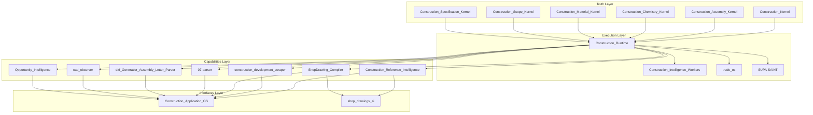

# Construction OS Layer Map

## Purpose

This document maps only the currently confirmed Construction OS repositories. Provisional, unaudited, and PRE-UTK systems are intentionally excluded until audit or owner approval admits them.

## Identity

| Field | Value |
|-------|-------|
| **system** | Construction_OS |
| **system_family** | ValidKernel |
| **system_type** | Domain_OS |
| **truth_root** | Construction_Kernel |
| **execution_root** | Construction_Runtime |

### Architecture Layers

1. **Truth** — canonical domain knowledge kernels
2. **Execution** — runtime, workers, and execution platforms
3. **Capabilities** — intelligence, scraping, parsing, rendering
4. **Interfaces** — application surfaces and user-facing systems
5. **Excluded** — not yet admitted through audit or owner approval

### Truth Flow

Construction OS truth flows through:

```
Universal_Truth_Kernel
  → Construction_Kernel (domain truth boundaries)
    → Truth Event Model (stateful event-based truth)
      → Runtime validation (Construction_Runtime)
        → Capabilities (intelligence, parsing, extraction)
          → Interfaces (applications, user surfaces)
```

The **Truth Event Model** sits between the kernel doctrine and runtime execution. See [`CONSTRUCTION_TRUTH_EVENT_MODEL.md`](CONSTRUCTION_TRUTH_EVENT_MODEL.md) for the full specification.

---

## Confirmed Core Layer Map

### Truth Layer

| Repository | Role |
|------------|------|
| Construction_Kernel | Canonical domain truth kernel (7 supporting kernels) |
| Construction_Assembly_Kernel | Assembly-domain truth: systems, layers, components, continuity |
| Construction_Chemistry_Kernel | Chemistry-domain truth: polymers, cure mechanisms, compatibility |
| Construction_Material_Kernel | Material-domain truth: classes, properties, performance |
| Construction_Scope_Kernel | Scope-domain truth: operations, sequencing, trade responsibility |
| Construction_Specification_Kernel | Specification-domain truth: documents, requirements, standards |

### Execution Layer

| Repository | Role |
|------------|------|
| Construction_Runtime | Execution engine for Construction OS |
| Construction_Intelligence_Workers | Worker fleet for construction signal generation |
| trade_os | Execution platform for service-based contractor operations |
| SUPA-SAINT | Execution platform for building-envelope delivery pipeline |

### Capabilities Layer

| Repository | Role |
|------------|------|
| Construction_Reference_Intelligence | Evidence-linked intelligence curation |
| construction_development_scraper | Permit and development opportunity scraping |
| ShopDrawing_Compiler | Shop drawing compilation and assembly |
| 07-parser | Division 07 specification parsing |
| dxf_Generatior_Assembly_Letter_Parser | DXF generation and assembly letter parsing |
| cad_observer | CAD file observation and extraction |
| Opportunity_Intelligence | Opportunity discovery and qualification |

### Interfaces Layer

| Repository | Role |
|------------|------|
| Construction_Application_OS | Application coordination, workflows, role models |
| shop_drawings_ai | AI-powered shop drawing interface |

### Excluded / Not Yet Admitted

| Repository | Reason |
|------------|--------|
| CADless_drawings | PRE-UTK independent system |
| Holograms | Experimental / provisional |
| construction_dna | Pending structural audit |
| GPC_Shop_Drawings | Pending audit |
| Roofing_OS | Pending audit |
| Construction_Assistant | Pending audit |
| ingestor | Pending audit |
| AI_app_IO | Pending audit |
| dispatcher-app | Pending audit |
| ElectriciansAssistant | Pending audit |
| fire_proof_assistant | Pending audit |
| Vapi-AI-Assistant-for-electrical-contracting | Pending audit |
| OMNI-VIEW | Pending audit |
| roofio-marketing | Pending audit |
| Roofshopdrawings.com | Pending audit |
| Jenkintownelectricity_time_saver | Pending audit |
| fast_brain | Pending audit |

### Exclusion Note

Exclusion from this canonical map means admission has not yet occurred. It does NOT imply rejection or irrelevance.

Repositories may be admitted through:

- Completed architectural audit
- Registry confirmation
- Explicit owner approval

### Owner-Approved Admission Note

**trade_os** and **SUPA-SAINT** are admitted into Construction OS through completed audit and explicit owner approval.

**Admission status:** V2 Approved

---

## Architecture Diagram


