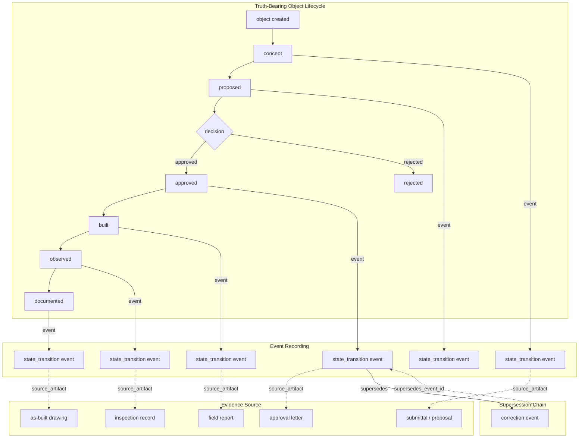

# Construction Truth Spine

## 1. Purpose

The Construction Truth Spine is the canonical construction truth history model. It defines how truth-bearing construction objects are tracked through stateful, event-based, source-linked, append-only history.

The Truth Spine translates the governance doctrine established in `ValidKernel-Governance/docs/validkernel/construction-truth-spine-doctrine.md` into architectural structure within the Construction domain.

---

## 2. Spine Position in the Architecture

```
Universal_Truth_Kernel
  → Construction_Kernel
    → Construction Truth Spine
      → Construction_Runtime
        → Capabilities
          → Interfaces
```

The Truth Spine sits between the Construction_Kernel domain truth boundaries and Construction_Runtime execution. It is the layer where abstract truth rules become concrete event-based history that runtime components can consume.

---

## 3. Truth-Bearing Objects

The following object types may participate in the Truth Spine:

| Object Type | Description |
|-------------|-------------|
| assembly | A proposed or actual construction configuration |
| detail | A specific construction detail or connection |
| material application | A material applied to a construction element |
| condition | An observed physical state of a building component |
| approval | A formal acceptance or rejection decision |
| observation | A recorded inspection, measurement, or field note |
| deliverable | A document, drawing, or package produced for a purpose |
| deviation | A departure from the approved or specified condition |
| project location | A governed spatial reference within the project |

This list is not exhaustive. Additional object types may be admitted through governance.

---

## 4. Canonical States

The approved state ladder for truth-bearing construction objects:

| State | Position |
|-------|----------|
| `concept` | 1 |
| `proposed` | 2 |
| `approved` | 3 |
| `rejected` | 3 (terminal branch) |
| `built` | 4 |
| `observed` | 5 |
| `documented` | 6 |
| `superseded` | 7 (non-current) |

---

## 5. State Meaning

State determines the type and strength of truth held by an object. An object in `proposed` state carries proposed truth — it represents intent under review. An object in `built` state carries asserted realized truth — it represents a claim of physical existence. The state defines the epistemic weight of the truth record.

---

## 6. Identity Dependency

All durable truth transitions depend on stable object identity. Without governed identity, the system cannot reliably assert that a sequence of events belongs to the same object.

If object identity is unresolved, truth may be recorded provisionally. Provisional records must be explicitly marked and must fail closed for final continuity claims. The Truth Spine does not resolve identity — it depends on a governed identity system to provide stable identifiers.

---

## 7. Assembly Truth Rule

An assembly becomes actual construction truth only when it is both:

- **built** — physical construction has been asserted
- **observed** — the built condition has been independently verified

Before that point, an assembly may carry:

| State | Truth Classification |
|-------|---------------------|
| `concept` | Preliminary — not yet truth |
| `proposed` | Proposed truth — under review |
| `approved` | Authorized intended truth |
| `built` (not yet observed) | Asserted realized truth |

This distinction prevents the system from treating design intent as verified physical reality.

---

## 8. Event Spine Rule

Truth changes are recorded as events, not document edits. Every state transition produces a truth event in the spine. The event captures the prior state, new state, source artifact, authority, and extracted facts. The spine is the canonical record of truth evolution.

---

## 9. Source Relationship Rule

Each event must link back to a source artifact or observation surface. The source artifact is the evidence from which facts were extracted. Without source linkage, the event has no traceable provenance.

---

## 10. Event Chronology Rule

Events form an append-only chronological ledger. Events are ordered by `recorded_timestamp`. No event may be inserted retroactively into the ledger. New events may reference prior events through `supersedes_event_id` but do not alter the prior event's position or content.

---

## 11. Supersession Rule

Later corrections supersede earlier events; they do not erase them. A superseding event records the corrected truth and references the event it replaces. The original event remains in the ledger as historical record. The current truth of any object is derived by replaying its event history with supersession applied.

---

## 12. State Strength Note

| State | Truth Strength |
|-------|---------------|
| `approved` | Authorized intended truth — approved by authority but not yet physical |
| `built` | Asserted realized truth — claimed to be physically constructed |
| `observed` | Evidenced realized truth — independently verified physical condition |
| `documented` | Recorded representational truth — formally recorded in the deliverable record |
| `superseded` | Non-current but preserved historical truth — replaced by a newer condition |

---

## 13. Why This Matters

The Truth Spine enables:

- **Proposed vs approved comparison** — what was intended vs what was authorized
- **Approved vs built comparison** — what was authorized vs what was constructed
- **Built vs observed comparison** — what was claimed vs what was verified
- **Observed vs documented comparison** — what was verified vs what was recorded
- **As-built truth** — the verified physical state of construction
- **Deviation detection** — identifying departures from approved conditions
- **Future digital twin reconciliation** — connecting physical reality to its digital representation through traceable event history

---

## 14. Truth Spine Diagram



---

## Safety Note

- This document defines architecture documentation only.
- No runtime code, schemas, or implementations are modified.
- No existing registry entries are changed.
- The Truth Spine described here is a canonical architecture specification, not a live event store implementation.
- The Truth Spine depends on a governed identity system that is not yet defined in this pass.
